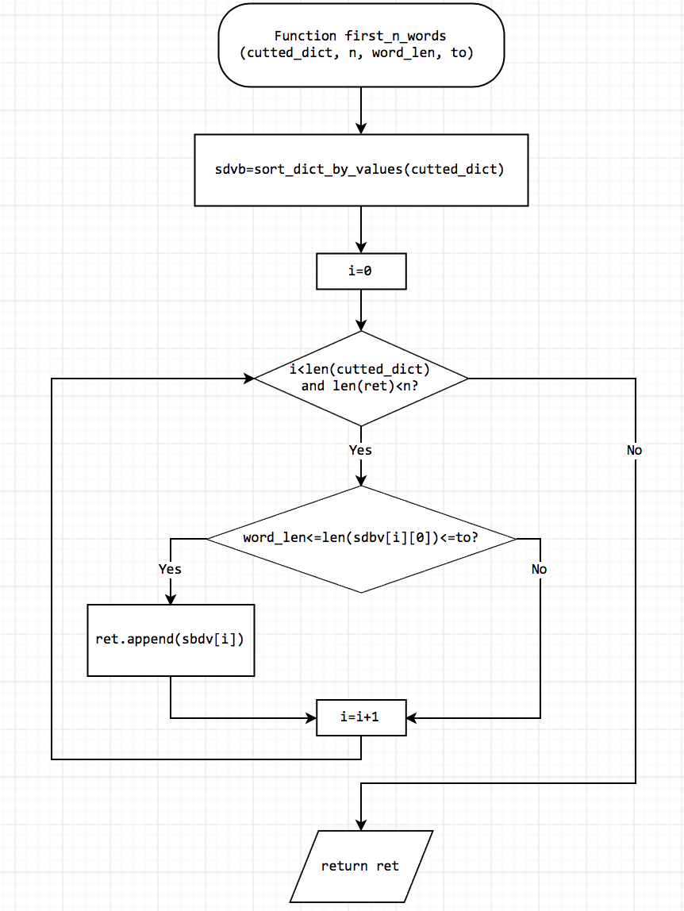

---
./
---

###HW0

---

##### Author: B06902097 資工二 楊皓丞

三個level中挑選的皆為`first_n_words(cutted_dict, n, word_len, to)`這個function的程式區段，此function扮演著從字典中找出詞頻最高的滿足名稱字數範圍限制的$n$個詞語，在整份project中有舉足輕重的地位，且return那行使用了展現python威力的一行式指令，因此以這段程式碼下手。

##### Level 1

因為載下來字體會跑掉，決定用截圖的。



##### Level 2

```python
def first_n_words(cutted_dict, n, word_len=2, to=1000):
    sdbv = sort_dict_by_values(cutted_dict) #將字典改用value而非key逆序排序，並回傳item list
    return list(filter(lambda x: len(x[0])>=word_len and len(x[0])<=to, sdbv))[:n]
	'''
	首先，filter和map都是python中對list的每個元素做相同操作時可以使用的好用函式，其中filter語法為給定一個list(此例中為sdbv)，和一個bool function，把所有函式回傳值為True的元蒐集起來。而這裡的function本應使用自定義函式來判斷一個此item中，名稱的長度是否在給定的參數之間，但因為內容運算簡單，可以利用python中的lambda語法，也就是inline function來撰寫。而最後再把filter型態轉回list型態，就得到了滿足字數限制的詞語及詞頻，且按照詞頻從大到小排序。最後，因為我們只要前n個，因此用slice語法將list的前n個物品slice出來即可。
	'''
```

##### Level 3

此段程式碼在判斷字數長度是否在`word_len`和`to`之間時，使用的是C式的語法，即分別判斷大於等於和小於等於是否皆成立。事實上python語法支援直接用`word_len <= len(x[0]) <= to`這樣的寫法，會更加簡短易懂。此外，`word_len`和`to`在此段程式碼式為字數上界和下界的相應變數，命名上應該要有一致性，才方便閱讀。可惜的是，`from`在python中已有其意義，無法作為變數名稱（原作者可能也是因此才將其改名為`word_len`），這裡也許可以改命名成`l`及`r`。還有，等於左右是否加空白在整份code應該要統一。修改如下：

```python
def first_n_words(cutted_dict, n, l = 2, r = 1000):
    sdbv = sort_dict_by_values(cutted_dict)
    return list(filter(lambda x: l <= len(x[0]) <= r, sdbv))[:n]
```