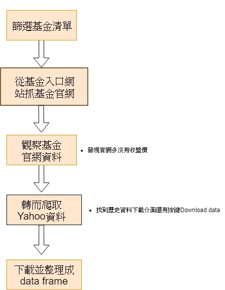

1.  這次import到的套件有
- pandas --用於讀取、處理數據
- numpy--用於蒐集資料的處理
- requests--用於網頁爬蟲 
- bs4--用於網頁爬蟲     
- urllib.request--用於網頁爬蟲
- os--用於處理電腦內部的資料
- pyquery--用於網頁爬蟲
- pickle-用於文件的處理
- selenium--用於模擬人來爬取網頁
- datetime--用於訂定爬取時間
- time--用於訂定爬蟲中休息間隔
- calendar--用於訂定年份

2.

3.
使用者在使用這份code的時候可能會遇到一些錯誤，這裡提供一些可能及改進的方法

- 在import的時候出現error，這是有些套件可能在你的本機沒有下載，可以用conda install來下載。例如，`conda install selenium`。
- 在執行程式時有一些程式碼的部分可能要根據環境調整
	- 請將`In [7]`部分的載入csv檔時的路徑改成ETF_List.csv所在的路徑
	- 請去`http://chromedriver.chromium.org`下載符合你電腦環境的chromedriver，並將它放到anaconda的bin路徑底下
	- 請在程式的同一層開好data資料夾，chrome預設會把資料下載到那裡，若不想這樣做，也可以調整程式，`options.add_argument("download.default_directory=.\data")`這裡的directory改一下，讓他存到別的地方
	- 最後在處理下載下來的csv的地方，根據上面你存在不同的地方，也要改路徑。
